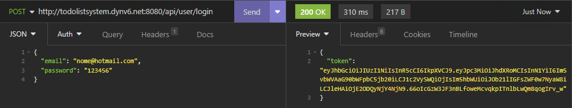

# O que é esse projeto?
Esse projeto é uma API RESTful capaz de criar usuários, fazer login no sistema, 
criar, alterar, deletar e concluir tarefas que o usuário especificar.

# Tecnologias usadas

- [X] Kotlin
- [X] Spring MVC
- [X] Spring Data JPA
- [X] Spring Security
- [X] Hibernate
- [X] JWT Token
- [X] MySQL
- [X] Docker
- [X] Gradle
- [X] JUnit
- [X] MockK
- [X] H2 Database como banco de dados de teste.

# Como executar o projeto?

Primeiramente tenha a JDK 17 e opcionalmente o Gradle no seu sistema.

### Via repositório
Faça um ```git clone``` ou download do meu repositório e coloque na pasta de sua escolha. 
Entre no ```src/main/resources/application.properties``` e altere esses parâmetros abaixo para o seu próprio banco de dados MySQL.
```properties
spring.datasource.url=jdbc:mysql://seubancoaqui
spring.datasource.username=seu usuário aqui
spring.datasource.password=sua senha aqui
spring.datasource.driver-class-name=com.mysql.cj.jdbc.Driver
```

### Via container
Tenha certeza de que suas portas 8080 e 3306 estejam abertas na sua rede e que você já tenha o Docker e Docker Compose, depois siga os passos abaixo na sua Virtual Machine:
```
git clone https://github.com/Matysys/todolist-system-api-backend.git
cd todolist-system-api-backend
docker compose up -d
```
Assim acesse os endpoints pelo IP da sua Virtual Machine ou do seu próprio sistema na porta 8080.

# Requisitos funcionais e não funcionais

### Funcionais
- Deve permitir criar um usuário no sistema
- Deve permitir logar no sistema
- Deve permitir criar, alterar, deletar e concluir uma tarefa no sistema
- Deve listar as tarefas do usuário logado
- Deve mostrar detalhes adicionais sobre as tarefas
- Deve permitir ver os usuários pelo ID para testes

### Não Funcionais
- Kotlin deve ser a linguagem de programação padrão
- A API deve ter autenticação JWT Token
- A senha do usuário deve ser criptografada

# ENDPOINTS

## Endpoints do usuário

Agora irei explicar sobre os endpoints existentes nessa API.

Usarei como endpoint principal o ```http://todolistsystem.dynv6.net:8080/api/```, mas 
se você estiver executando o projeto localmente, substituia o ```todolistsystem.dynv6.net:8080``` por 
```localhost:8080```. Usarei o Insomnia para testes de requisições, mas você também pode utilizar o Postman.

### Criar usuário

Endpoint: http://todolistsystem.dynv6.net:8080/api/user

Método de requisição: POST

HTTP Status se for realizado com sucesso: 201

Retorno: String

Envie os dados no formato JSON como no exemplo abaixo:


**Informação importante:** A senha do usuário é criptografada com um algoritmo do ```Spring Security```.

### Listar usuário pelo ID

Endpoint: http://todolistsystem.dynv6.net:8080/api/user/id

Troque o id pelo número em questão. O método de requisição é GET, o status code 
é 200 se for feito com sucesso, e o retorno é um objeto com os parâmetros do usuário. Veja abaixo:


Nesse caso eu permiti que a password fosse retornada pra demonstrar que ela está criptografada.

### Fazer login no sistema

Endpoint: http://todolistsystem.dynv6.net:8080/api/user/login

O método de requisição é POST, o status code
é 200 se for feito com sucesso ou 401 se não for autorizado, e o retorno é um JWT Token com alguns dados do usuário no payload, como nome, id e e-mail. Veja abaixo um exemplo com sucesso:



Agora um exemplo sem sucesso como por exemplo errando a senha:


### Deletar usuário

Endpoint: http://todolistsystem.dynv6.net:8080/api/user/id

Troque o id pelo número em questão. O método de requisição é DELETE, o status code
é 204 para uma exclusão com sucesso, e não há retorno. Veja abaixo:


O método de exclusão de usuário não está disponível no frontend, somente diretamente pela API.

-----------------------------------------------------------------------------------------------

## Endpoints da lista de tarefas

Os endpoints da lista de tarefas com exceção da listagem de tarefas e detalhes precisam do JWT Token em cada requisição pra confirmar o usuário. O userId e taskId são obtidos automaticamente em requisições realizadas pelo frontend. 
Isso é necessário porque o alterações de PATCH, POST e DELETE fazem alterações no sistema, enquanto o GET não. Esse é um uso super básico do JWT Token que pode ser melhorado.

### Criar uma tarefa

Endpoint: http://todolistsystem.dynv6.net:8080/api/todolist

O método de requisição é POST, o status code
é 200 se a requisição for feita com sucesso e 400 se a data for inválida. O retorno é uma string.

Veja os exemplos abaixo:


É necessário passar esses dados, assim como o exemplo. O formato do ```finalDate``` é no formato americano, e essa é a data prevista para terminar a tarefa. 
O ```userId``` é o ID do usuário que vai ter essa nova tarefa em questão.

Veja os headers abaixo:


O Header se chama Authorization, e como parâmetro você deve passar "Bearer token". Substituia "token" pelo seu token real.

Agora o exemplo de um token inválido (o que pode acontecer quando a sessão expirar).


Agora se a data for inválida, como por exemplo um dia que já passou:


### Listar todas as tarefas do usuário pelo id

Endpoint: http://todolistsystem.dynv6.net:8080/api/todolist/id

Substitoa o id no endpoint pelo número em questão. O método da requisição é GET, o status code
é 200 se a requisição for feita com sucesso e o retorno é uma List<Tarefas> em formato JSON.

Não é necessário o uso do JWT Token aqui.

Veja o exemplo abaixo:


### Alterar uma tarefa

Endpoint: http://todolistsystem.dynv6.net:8080/api/todolist/update

O método de requisição é PATCH, o status code
é 200 se a requisição for feita com sucesso, 400 se a data for inválida e 401 se o token for inválido. O retorno é uma string.

Veja o exemplo abaixo:


Você precisa passar o id da tarefa (o frontend cuida disso), o id do usuário (frontend) e o resto das informações.

### Deletar uma tarefa

Endpoint: http://todolistsystem.dynv6.net:8080/api/todolist/delete/taskId

Substitua o taskId pelo número em questão da tarefa.

O método de requisição é DELETE, o status code
é 204 se a requisição for feita com sucesso e 401 se a token for inválido. O retorno é uma string para o token inválido e vazio para a exclusão.

Veja o exemplo abaixo:


### Finalizar uma tarefa

Endpoint: http://todolistsystem.dynv6.net:8080/api/todolist/finish/taskId

Substitua o taskId pelo número em questão da tarefa.

O método de requisição é PATCH, o status code
é 200 se a requisição for feita com sucesso e 401 se a token for inválido. O retorno é uma String.

Veja o exemplo abaixo:


### Mostrar detalhes sobre as tarefas

Endpoint: http://todolistsystem.dynv6.net:8080/api/todolist/details/userId

Substitua o userId pelo número em questão do usuário.

O método de requisição é GET, o status code
é 200 se a requisição for feita com sucesso. O retorno é um Array com os detalhes.

- ```totalTasks``` para o número total de tarefas.
- ```totalBaixa``` para o número total de tarefas com prioridade baixa.
- ```totalMedia``` para o número total de tarefas com prioridade média.
- ```totalAlta``` para o número total de tarefas com prioridade alta.
- ```totalOutOfLimit``` para o número total de tarefas que passaram do prazo.
- ```totalfinished``` para o número total de tarefas finalizadas.

Veja o exemplo abaixo:


**BÔNUS:**

Essa é a instrução SQL executada para obter esses detalhes (utilizei o Beekeeper Studio para isso):


---------------------------------------------------------------------------------

# Testes unitários

Será adicionado futuramente.


